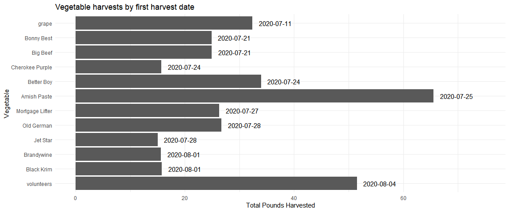
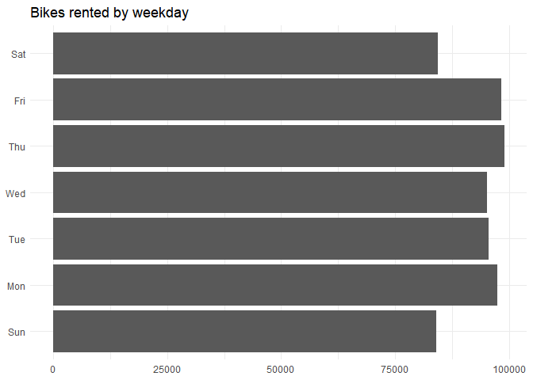
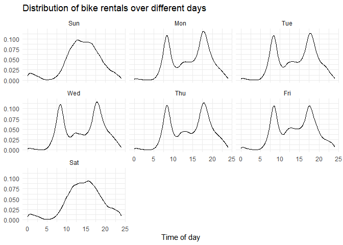
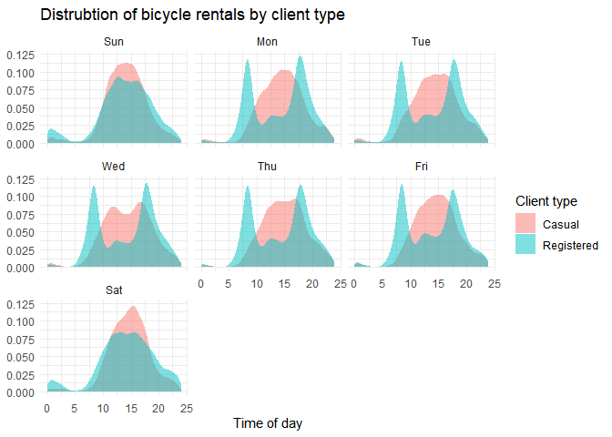
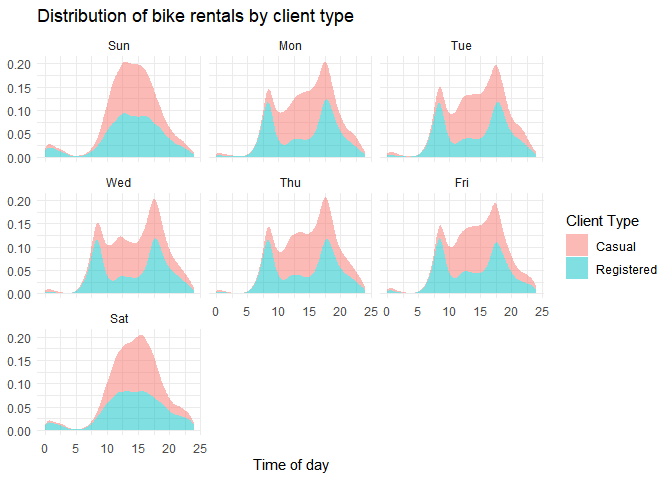
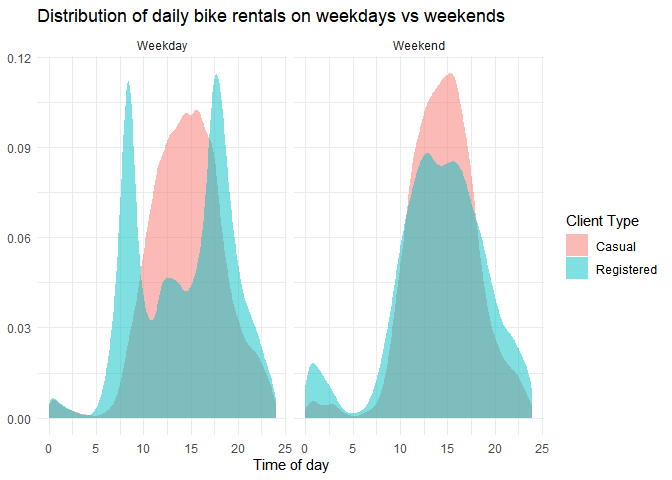
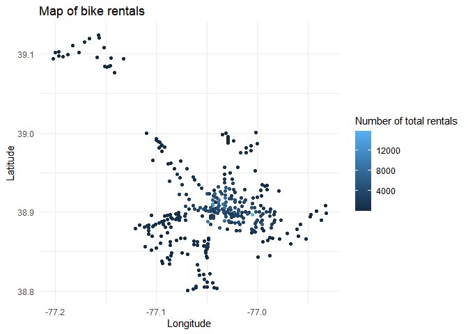
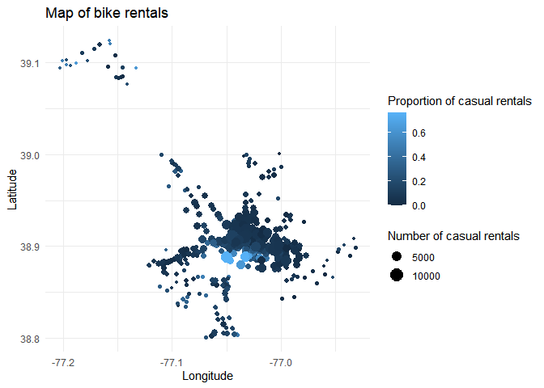

```r
library(tidyverse)     # for graphing and data cleaning
library(gardenR)       # for Lisa's garden data
library(lubridate)     # for date manipulation
library(ggthemes)      # for even more plotting themes
library(geofacet)      # for special faceting with US map layout
theme_set(theme_minimal())       # My favorite ggplot() theme :)
```


```r
# Lisa's garden data
data("garden_harvest")

# Seeds/plants (and other garden supply) costs
data("garden_spending")

# Planting dates and locations
data("garden_planting")

# Tidy Tuesday dog breed data
breed_traits <- readr::read_csv('https://raw.githubusercontent.com/rfordatascience/tidytuesday/master/data/2022/2022-02-01/breed_traits.csv')
trait_description <- readr::read_csv('https://raw.githubusercontent.com/rfordatascience/tidytuesday/master/data/2022/2022-02-01/trait_description.csv')
breed_rank_all <- readr::read_csv('https://raw.githubusercontent.com/rfordatascience/tidytuesday/master/data/2022/2022-02-01/breed_rank.csv')

# Tidy Tuesday data for challenge problem
kids <- readr::read_csv('https://raw.githubusercontent.com/rfordatascience/tidytuesday/master/data/2020/2020-09-15/kids.csv')
```

## Setting up on GitHub!

Before starting your assignment, you need to get yourself set up on GitHub and make sure GitHub is connected to R Studio. To do that, you should read the instruction (through the "Cloning a repo" section) and watch the video [here](https://github.com/llendway/github_for_collaboration/blob/master/github_for_collaboration.md). Then, do the following (if you get stuck on a step, don't worry, I will help! You can always get started on the homework and we can figure out the GitHub piece later):

* Create a repository on GitHub, giving it a nice name so you know it is for the 3rd weekly exercise assignment (follow the instructions in the document/video).  
* Copy the repo name so you can clone it to your computer. In R Studio, go to file --> New project --> Version control --> Git and follow the instructions from the document/video.  
* Download the code from this document and save it in the repository folder/project on your computer.  
* In R Studio, you should then see the .Rmd file in the upper right corner in the Git tab (along with the .Rproj file and probably .gitignore).  
* Check all the boxes of the files in the Git tab and choose commit.  
* In the commit window, write a commit message, something like "Initial upload" would be appropriate, and commit the files.  
* Either click the green up arrow in the commit window or close the commit window and click the green up arrow in the Git tab to push your changes to GitHub.  
* Refresh your GitHub page (online) and make sure the new documents have been pushed out.  
* Back in R Studio, knit the .Rmd file. When you do that, you should have two (as long as you didn't make any changes to the .Rmd file, in which case you might have three) files show up in the Git tab - an .html file and an .md file. The .md file is something we haven't seen before and is here because I included `keep_md: TRUE` in the YAML heading. The .md file is a markdown (NOT R Markdown) file that is an interim step to creating the html file. They are displayed fairly nicely in GitHub, so we want to keep it and look at it there. Click the boxes next to these two files, commit changes (remember to include a commit message), and push them (green up arrow).  
* As you work through your homework, save and commit often, push changes occasionally (maybe after you feel finished with an exercise?), and go check to see what the .md file looks like on GitHub.  
* If you have issues, let me know! This is new to many of you and may not be intuitive at first. But, I promise, you'll get the hang of it! 


## Instructions

* Put your name at the top of the document. 

* **For ALL graphs, you should include appropriate labels.** 

* Feel free to change the default theme, which I currently have set to `theme_minimal()`. 

* Use good coding practice. Read the short sections on good code with [pipes](https://style.tidyverse.org/pipes.html) and [ggplot2](https://style.tidyverse.org/ggplot2.html). **This is part of your grade!**

* When you are finished with ALL the exercises, uncomment the options at the top so your document looks nicer. Don't do it before then, or else you might miss some important warnings and messages.


## Warm-up exercises with garden data

These exercises will reiterate what you learned in the "Expanding the data wrangling toolkit" tutorial. If you haven't gone through the tutorial yet, you should do that first.

  1. Summarize the `garden_harvest` data to find the total harvest weight in pounds for each vegetable and day of week (HINT: use the `wday()` function from `lubridate`). Display the results so that the vegetables are rows but the days of the week are columns.


```r
  garden_harvest %>% 
    mutate(weekday = wday(date, label = TRUE)) %>% 
    group_by(weekday, vegetable) %>% 
    summarize(WD_total = sum(weight)*.0022) %>% 
    pivot_wider(vegetable, names_from = weekday, values_from = WD_total, values_fill = 0)
```

<div data-pagedtable="false">
  <script data-pagedtable-source type="application/json">
{"columns":[{"label":["vegetable"],"name":[1],"type":["chr"],"align":["left"]},{"label":["Sun"],"name":[2],"type":["dbl"],"align":["right"]},{"label":["Mon"],"name":[3],"type":["dbl"],"align":["right"]},{"label":["Tue"],"name":[4],"type":["dbl"],"align":["right"]},{"label":["Wed"],"name":[5],"type":["dbl"],"align":["right"]},{"label":["Thu"],"name":[6],"type":["dbl"],"align":["right"]},{"label":["Fri"],"name":[7],"type":["dbl"],"align":["right"]},{"label":["Sat"],"name":[8],"type":["dbl"],"align":["right"]}],"data":[{"1":"beans","2":"1.9096","3":"6.4944","4":"4.3780","5":"4.0744","6":"3.3858","7":"1.5224","8":"4.6992"},{"1":"beets","2":"0.3212","3":"0.6710","4":"0.1584","5":"0.1826","6":"11.8668","7":"0.0242","8":"0.3784"},{"1":"broccoli","2":"1.2562","3":"0.8184","4":"0.0000","5":"0.7062","6":"0.0000","7":"0.1650","8":"0.0000"},{"1":"carrots","2":"2.9304","3":"0.8690","4":"0.3520","5":"5.5506","6":"2.6686","7":"2.1340","8":"2.3254"},{"1":"corn","2":"1.4542","3":"0.7568","4":"0.7260","5":"5.2910","6":"0.0000","7":"3.4408","8":"1.3134"},{"1":"cucumbers","2":"3.0976","3":"4.7652","4":"10.0254","5":"5.2954","6":"3.3000","7":"7.4140","8":"9.6206"},{"1":"jalapeño","2":"0.2618","3":"5.5418","4":"0.5478","5":"0.4796","6":"0.2244","7":"1.2914","8":"1.5048"},{"1":"kale","2":"0.8250","3":"2.0636","4":"0.2816","5":"0.6160","6":"0.2794","7":"0.3806","8":"1.4872"},{"1":"lettuce","2":"1.4630","3":"2.4530","4":"0.9152","5":"1.1836","6":"2.4464","7":"1.7974","8":"1.3134"},{"1":"onions","2":"0.2596","3":"0.5082","4":"0.7062","5":"0.0000","6":"0.6006","7":"0.0726","8":"1.9096"},{"1":"peas","2":"2.0526","3":"4.6244","4":"2.0636","5":"1.0780","6":"3.3902","7":"0.9350","8":"2.8468"},{"1":"peppers","2":"0.5016","3":"2.5212","4":"1.4410","5":"2.4376","6":"0.7084","7":"0.3344","8":"1.3794"},{"1":"radish","2":"0.0814","3":"0.1958","4":"0.0946","5":"0.0000","6":"0.1474","7":"0.1936","8":"0.2310"},{"1":"rutabaga","2":"19.2236","3":"0.0000","4":"0.0000","5":"0.0000","6":"0.0000","7":"3.5706","8":"6.8838"},{"1":"spinach","2":"0.4862","3":"0.1474","4":"0.4950","5":"0.2134","6":"0.2332","7":"0.1958","8":"0.2596"},{"1":"strawberries","2":"0.0814","3":"0.4774","4":"0.0000","5":"0.0000","6":"0.0880","7":"0.4862","8":"0.1694"},{"1":"Swiss chard","2":"1.2452","3":"1.0714","4":"0.0704","5":"0.9064","6":"2.2264","7":"0.6160","8":"0.7326"},{"1":"tomatoes","2":"75.4512","3":"11.4686","4":"48.6486","5":"58.1438","6":"34.4454","7":"84.8980","8":"35.0526"},{"1":"zucchini","2":"12.2100","3":"12.1704","4":"16.4340","5":"2.0372","6":"34.5576","7":"18.6824","8":"3.4078"},{"1":"basil","2":"0.0000","3":"0.0660","4":"0.1100","5":"0.0000","6":"0.0264","7":"0.4664","8":"0.4092"},{"1":"hot peppers","2":"0.0000","3":"1.2562","4":"0.1408","5":"0.0682","6":"0.0000","7":"0.0000","8":"0.0000"},{"1":"potatoes","2":"0.0000","3":"0.9680","4":"0.0000","5":"4.5606","6":"11.8272","7":"3.7334","8":"2.7962"},{"1":"pumpkins","2":"0.0000","3":"30.0564","4":"31.7900","5":"0.0000","6":"0.0000","7":"0.0000","8":"92.4946"},{"1":"raspberries","2":"0.0000","3":"0.1298","4":"0.3344","5":"0.0000","6":"0.2882","7":"0.5698","8":"0.5324"},{"1":"squash","2":"0.0000","3":"24.2836","4":"18.4294","5":"0.0000","6":"0.0000","7":"0.0000","8":"56.1044"},{"1":"cilantro","2":"0.0000","3":"0.0000","4":"0.0044","5":"0.0000","6":"0.0000","7":"0.0726","8":"0.0374"},{"1":"edamame","2":"0.0000","3":"0.0000","4":"1.3992","5":"0.0000","6":"0.0000","7":"0.0000","8":"4.6794"},{"1":"chives","2":"0.0000","3":"0.0000","4":"0.0000","5":"0.0176","6":"0.0000","7":"0.0000","8":"0.0000"},{"1":"kohlrabi","2":"0.0000","3":"0.0000","4":"0.0000","5":"0.0000","6":"0.4202","7":"0.0000","8":"0.0000"},{"1":"apple","2":"0.0000","3":"0.0000","4":"0.0000","5":"0.0000","6":"0.0000","7":"0.0000","8":"0.3432"},{"1":"asparagus","2":"0.0000","3":"0.0000","4":"0.0000","5":"0.0000","6":"0.0000","7":"0.0000","8":"0.0440"}],"options":{"columns":{"min":{},"max":[10]},"rows":{"min":[10],"max":[10]},"pages":{}}}
  </script>
</div>

  2. Summarize the `garden_harvest` data to find the total harvest in pound for each vegetable variety and then try adding the plot from the `garden_planting` table. This will not turn out perfectly. What is the problem? How might you fix it?


```r
  garden_harvest %>% 
    group_by(vegetable, variety) %>% 
    summarize(total_weight = sum(weight*.0022)) %>% 
    left_join(select(garden_planting, vegetable, variety, plot), by = c("vegetable","variety"))
```

<div data-pagedtable="false">
  <script data-pagedtable-source type="application/json">
{"columns":[{"label":["vegetable"],"name":[1],"type":["chr"],"align":["left"]},{"label":["variety"],"name":[2],"type":["chr"],"align":["left"]},{"label":["total_weight"],"name":[3],"type":["dbl"],"align":["right"]},{"label":["plot"],"name":[4],"type":["chr"],"align":["left"]}],"data":[{"1":"apple","2":"unknown","3":"0.3432","4":"NA"},{"1":"asparagus","2":"asparagus","3":"0.0440","4":"NA"},{"1":"basil","2":"Isle of Naxos","3":"1.0780","4":"potB"},{"1":"beans","2":"Bush Bush Slender","3":"22.0836","4":"M"},{"1":"beans","2":"Bush Bush Slender","3":"22.0836","4":"D"},{"1":"beans","2":"Chinese Red Noodle","3":"0.7832","4":"K"},{"1":"beans","2":"Chinese Red Noodle","3":"0.7832","4":"L"},{"1":"beans","2":"Classic Slenderette","3":"3.5970","4":"E"},{"1":"beets","2":"Gourmet Golden","3":"7.0070","4":"H"},{"1":"beets","2":"leaves","3":"0.2222","4":"NA"},{"1":"beets","2":"Sweet Merlin","3":"6.3734","4":"H"},{"1":"broccoli","2":"Main Crop Bravado","3":"2.1274","4":"D"},{"1":"broccoli","2":"Main Crop Bravado","3":"2.1274","4":"I"},{"1":"broccoli","2":"Yod Fah","3":"0.8184","4":"P"},{"1":"carrots","2":"Bolero","3":"8.2742","4":"H"},{"1":"carrots","2":"Bolero","3":"8.2742","4":"L"},{"1":"carrots","2":"Dragon","3":"4.0964","4":"H"},{"1":"carrots","2":"Dragon","3":"4.0964","4":"L"},{"1":"carrots","2":"greens","3":"0.3718","4":"NA"},{"1":"carrots","2":"King Midas","3":"4.0876","4":"H"},{"1":"carrots","2":"King Midas","3":"4.0876","4":"L"},{"1":"chives","2":"perrenial","3":"0.0176","4":"NA"},{"1":"cilantro","2":"cilantro","3":"0.1144","4":"potD"},{"1":"cilantro","2":"cilantro","3":"0.1144","4":"E"},{"1":"corn","2":"Dorinny Sweet","3":"11.3828","4":"A"},{"1":"corn","2":"Golden Bantam","3":"1.5994","4":"B"},{"1":"cucumbers","2":"pickling","3":"43.5182","4":"L"},{"1":"edamame","2":"edamame","3":"6.0786","4":"O"},{"1":"hot peppers","2":"thai","3":"0.1474","4":"potB"},{"1":"hot peppers","2":"variety","3":"1.3178","4":"potC"},{"1":"jalapeño","2":"giant","3":"9.8516","4":"L"},{"1":"kale","2":"Heirloom Lacinto","3":"5.9334","4":"P"},{"1":"kale","2":"Heirloom Lacinto","3":"5.9334","4":"front"},{"1":"kohlrabi","2":"Crispy Colors Duo","3":"0.4202","4":"front"},{"1":"lettuce","2":"Farmer's Market Blend","3":"3.7950","4":"C"},{"1":"lettuce","2":"Farmer's Market Blend","3":"3.7950","4":"L"},{"1":"lettuce","2":"Lettuce Mixture","3":"4.7388","4":"G"},{"1":"lettuce","2":"mustard greens","3":"0.0506","4":"NA"},{"1":"lettuce","2":"reseed","3":"0.0990","4":"NA"},{"1":"lettuce","2":"Tatsoi","3":"2.8886","4":"P"},{"1":"onions","2":"Delicious Duo","3":"0.7524","4":"P"},{"1":"onions","2":"Long Keeping Rainbow","3":"3.3044","4":"H"},{"1":"peas","2":"Magnolia Blossom","3":"7.4426","4":"B"},{"1":"peas","2":"Super Sugar Snap","3":"9.5480","4":"A"},{"1":"peppers","2":"green","3":"5.6804","4":"K"},{"1":"peppers","2":"green","3":"5.6804","4":"O"},{"1":"peppers","2":"variety","3":"3.6432","4":"potA"},{"1":"peppers","2":"variety","3":"3.6432","4":"potA"},{"1":"peppers","2":"variety","3":"3.6432","4":"potD"},{"1":"potatoes","2":"purple","3":"3.0030","4":"D"},{"1":"potatoes","2":"red","3":"4.4242","4":"I"},{"1":"potatoes","2":"Russet","3":"9.0728","4":"D"},{"1":"potatoes","2":"yellow","3":"7.3854","4":"I"},{"1":"potatoes","2":"yellow","3":"7.3854","4":"I"},{"1":"pumpkins","2":"Cinderella's Carraige","3":"32.8042","4":"B"},{"1":"pumpkins","2":"New England Sugar","3":"44.7656","4":"K"},{"1":"pumpkins","2":"saved","3":"76.7712","4":"B"},{"1":"radish","2":"Garden Party Mix","3":"0.9438","4":"C"},{"1":"radish","2":"Garden Party Mix","3":"0.9438","4":"G"},{"1":"radish","2":"Garden Party Mix","3":"0.9438","4":"H"},{"1":"raspberries","2":"perrenial","3":"1.8546","4":"NA"},{"1":"rutabaga","2":"Improved Helenor","3":"29.6780","4":"NA"},{"1":"spinach","2":"Catalina","3":"2.0306","4":"H"},{"1":"spinach","2":"Catalina","3":"2.0306","4":"E"},{"1":"squash","2":"Blue (saved)","3":"41.4370","4":"A"},{"1":"squash","2":"Blue (saved)","3":"41.4370","4":"B"},{"1":"squash","2":"delicata","3":"10.4764","4":"K"},{"1":"squash","2":"Red Kuri","3":"22.6842","4":"A"},{"1":"squash","2":"Red Kuri","3":"22.6842","4":"B"},{"1":"squash","2":"Red Kuri","3":"22.6842","4":"side"},{"1":"squash","2":"Waltham Butternut","3":"24.2198","4":"A"},{"1":"squash","2":"Waltham Butternut","3":"24.2198","4":"K"},{"1":"strawberries","2":"perrenial","3":"1.3024","4":"NA"},{"1":"Swiss chard","2":"Neon Glow","3":"6.8684","4":"M"},{"1":"tomatoes","2":"Amish Paste","3":"65.5358","4":"J"},{"1":"tomatoes","2":"Amish Paste","3":"65.5358","4":"N"},{"1":"tomatoes","2":"Better Boy","3":"33.9372","4":"J"},{"1":"tomatoes","2":"Better Boy","3":"33.9372","4":"N"},{"1":"tomatoes","2":"Big Beef","3":"24.9414","4":"N"},{"1":"tomatoes","2":"Black Krim","3":"15.7740","4":"N"},{"1":"tomatoes","2":"Bonny Best","3":"24.8710","4":"J"},{"1":"tomatoes","2":"Brandywine","3":"15.6134","4":"J"},{"1":"tomatoes","2":"Cherokee Purple","3":"15.6794","4":"J"},{"1":"tomatoes","2":"grape","3":"32.3268","4":"O"},{"1":"tomatoes","2":"Jet Star","3":"14.9930","4":"N"},{"1":"tomatoes","2":"Mortgage Lifter","3":"26.2702","4":"J"},{"1":"tomatoes","2":"Mortgage Lifter","3":"26.2702","4":"N"},{"1":"tomatoes","2":"Old German","3":"26.6618","4":"J"},{"1":"tomatoes","2":"volunteers","3":"51.5042","4":"N"},{"1":"tomatoes","2":"volunteers","3":"51.5042","4":"J"},{"1":"tomatoes","2":"volunteers","3":"51.5042","4":"front"},{"1":"tomatoes","2":"volunteers","3":"51.5042","4":"O"},{"1":"zucchini","2":"Romanesco","3":"99.4994","4":"D"}],"options":{"columns":{"min":{},"max":[10]},"rows":{"min":[10],"max":[10]},"pages":{}}}
  </script>
</div>

The data for total weight doesn't hold the information for plot, so we get redundant data for each different row displaying the new plot, which is a data acquisition problem, since the harvested plot wasn't recorded. We also have missing planting data, resulting in harvest data not having a corresponding plot for all of the harvested vegetables.The data is also a little messy, since we get a new row for each plot, so what I might do is pivot to a column of booleans for each plot to show where they were planted


  3. I would like to understand how much money I "saved" by gardening, for each vegetable type. Describe how I could use the `garden_harvest` and `garden_spending` datasets, along with data from somewhere like [this](https://products.wholefoodsmarket.com/search?sort=relevance&store=10542) to answer this question. You can answer this in words, referencing various join functions. You don't need R code but could provide some if it's helpful.

If you were able to create a table of vegetables and price by pound, you could left_join the price table to the garden_harvest data, and then just multiply the total harvest for each vegetable with its price to get a good estimate of the money you saved.

  4. Subset the data to tomatoes. Reorder the tomato varieties from smallest to largest first harvest date. Create a barplot of total harvest in pounds for each variety, in the new order.CHALLENGE: add the date near the end of the bar. (This is probably not a super useful graph because it's difficult to read. This is more an exercise in using some of the functions you just learned.)


```r
  garden_harvest %>% 
    filter(vegetable %in% "tomatoes") %>% 
    group_by(variety) %>%
    mutate(total_lbs = sum(weight*.0022))%>%
    group_by(total_lbs,variety) %>% 
    summarize(first_harvest = min(date)) %>% 
    arrange(first_harvest) %>% 
    ggplot(aes(y = fct_reorder(variety, first_harvest, .desc = TRUE), x = total_lbs)) +
    geom_col() +
  scale_x_continuous(limits = c(0,75)) +
    geom_text(aes(label = first_harvest), check_overlap = TRUE, hjust = -.2) +
    labs(y = "Vegetable",
         x = "Total Pounds Harvested",
         title = "Vegetable harvests by first harvest date")
```

<!-- -->

  5. In the `garden_harvest` data, create two new variables: one that makes the varieties lowercase and another that finds the length of the variety name. Arrange the data by vegetable and length of variety name (smallest to largest), with one row for each vegetable variety. HINT: use `str_to_lower()`, `str_length()`, and `distinct()`.
  

```r
  garden_harvest %>% 
    mutate(var_lwr = str_to_lower(variety), var_len = str_length(variety))  %>% 
    select(-c(date, weight, units)) %>% 
    distinct() %>% 
    arrange(var_len)
```

<div data-pagedtable="false">
  <script data-pagedtable-source type="application/json">
{"columns":[{"label":["vegetable"],"name":[1],"type":["chr"],"align":["left"]},{"label":["variety"],"name":[2],"type":["chr"],"align":["left"]},{"label":["var_lwr"],"name":[3],"type":["chr"],"align":["left"]},{"label":["var_len"],"name":[4],"type":["int"],"align":["right"]}],"data":[{"1":"potatoes","2":"red","3":"red","4":"3"},{"1":"hot peppers","2":"thai","3":"thai","4":"4"},{"1":"tomatoes","2":"grape","3":"grape","4":"5"},{"1":"jalapeño","2":"giant","3":"giant","4":"5"},{"1":"peppers","2":"green","3":"green","4":"5"},{"1":"pumpkins","2":"saved","3":"saved","4":"5"},{"1":"lettuce","2":"reseed","3":"reseed","4":"6"},{"1":"beets","2":"leaves","3":"leaves","4":"6"},{"1":"lettuce","2":"Tatsoi","3":"tatsoi","4":"6"},{"1":"carrots","2":"Dragon","3":"dragon","4":"6"},{"1":"carrots","2":"Bolero","3":"bolero","4":"6"},{"1":"potatoes","2":"purple","3":"purple","4":"6"},{"1":"potatoes","2":"yellow","3":"yellow","4":"6"},{"1":"carrots","2":"greens","3":"greens","4":"6"},{"1":"potatoes","2":"Russet","3":"russet","4":"6"},{"1":"hot peppers","2":"variety","3":"variety","4":"7"},{"1":"peppers","2":"variety","3":"variety","4":"7"},{"1":"broccoli","2":"Yod Fah","3":"yod fah","4":"7"},{"1":"edamame","2":"edamame","3":"edamame","4":"7"},{"1":"apple","2":"unknown","3":"unknown","4":"7"},{"1":"spinach","2":"Catalina","3":"catalina","4":"8"},{"1":"cilantro","2":"cilantro","3":"cilantro","4":"8"},{"1":"cucumbers","2":"pickling","3":"pickling","4":"8"},{"1":"tomatoes","2":"Big Beef","3":"big beef","4":"8"},{"1":"tomatoes","2":"Jet Star","3":"jet star","4":"8"},{"1":"squash","2":"delicata","3":"delicata","4":"8"},{"1":"squash","2":"Red Kuri","3":"red kuri","4":"8"},{"1":"chives","2":"perrenial","3":"perrenial","4":"9"},{"1":"strawberries","2":"perrenial","3":"perrenial","4":"9"},{"1":"asparagus","2":"asparagus","3":"asparagus","4":"9"},{"1":"Swiss chard","2":"Neon Glow","3":"neon glow","4":"9"},{"1":"raspberries","2":"perrenial","3":"perrenial","4":"9"},{"1":"zucchini","2":"Romanesco","3":"romanesco","4":"9"},{"1":"tomatoes","2":"Bonny Best","3":"bonny best","4":"10"},{"1":"carrots","2":"King Midas","3":"king midas","4":"10"},{"1":"tomatoes","2":"Better Boy","3":"better boy","4":"10"},{"1":"tomatoes","2":"Old German","3":"old german","4":"10"},{"1":"tomatoes","2":"Brandywine","3":"brandywine","4":"10"},{"1":"tomatoes","2":"Black Krim","3":"black krim","4":"10"},{"1":"tomatoes","2":"volunteers","3":"volunteers","4":"10"},{"1":"tomatoes","2":"Amish Paste","3":"amish paste","4":"11"},{"1":"beets","2":"Sweet Merlin","3":"sweet merlin","4":"12"},{"1":"squash","2":"Blue (saved)","3":"blue (saved)","4":"12"},{"1":"basil","2":"Isle of Naxos","3":"isle of naxos","4":"13"},{"1":"onions","2":"Delicious Duo","3":"delicious duo","4":"13"},{"1":"corn","2":"Dorinny Sweet","3":"dorinny sweet","4":"13"},{"1":"corn","2":"Golden Bantam","3":"golden bantam","4":"13"},{"1":"lettuce","2":"mustard greens","3":"mustard greens","4":"14"},{"1":"beets","2":"Gourmet Golden","3":"gourmet golden","4":"14"},{"1":"lettuce","2":"Lettuce Mixture","3":"lettuce mixture","4":"15"},{"1":"tomatoes","2":"Cherokee Purple","3":"cherokee purple","4":"15"},{"1":"tomatoes","2":"Mortgage Lifter","3":"mortgage lifter","4":"15"},{"1":"radish","2":"Garden Party Mix","3":"garden party mix","4":"16"},{"1":"kale","2":"Heirloom Lacinto","3":"heirloom lacinto","4":"16"},{"1":"peas","2":"Magnolia Blossom","3":"magnolia blossom","4":"16"},{"1":"peas","2":"Super Sugar Snap","3":"super sugar snap","4":"16"},{"1":"rutabaga","2":"Improved Helenor","3":"improved helenor","4":"16"},{"1":"beans","2":"Bush Bush Slender","3":"bush bush slender","4":"17"},{"1":"broccoli","2":"Main Crop Bravado","3":"main crop bravado","4":"17"},{"1":"kohlrabi","2":"Crispy Colors Duo","3":"crispy colors duo","4":"17"},{"1":"squash","2":"Waltham Butternut","3":"waltham butternut","4":"17"},{"1":"pumpkins","2":"New England Sugar","3":"new england sugar","4":"17"},{"1":"beans","2":"Chinese Red Noodle","3":"chinese red noodle","4":"18"},{"1":"beans","2":"Classic Slenderette","3":"classic slenderette","4":"19"},{"1":"onions","2":"Long Keeping Rainbow","3":"long keeping rainbow","4":"20"},{"1":"lettuce","2":"Farmer's Market Blend","3":"farmer's market blend","4":"21"},{"1":"pumpkins","2":"Cinderella's Carraige","3":"cinderella's carraige","4":"21"}],"options":{"columns":{"min":{},"max":[10]},"rows":{"min":[10],"max":[10]},"pages":{}}}
  </script>
</div>

  6. In the `garden_harvest` data, find all distinct vegetable varieties that have "er" or "ar" in their name. HINT: `str_detect()` with an "or" statement (use the | for "or") and `distinct()`.


```r
  garden_harvest %>% 
    filter(str_detect(variety, "er")|str_detect(variety, "ar")) %>% 
    select(vegetable, variety) %>% 
    distinct()
```

<div data-pagedtable="false">
  <script data-pagedtable-source type="application/json">
{"columns":[{"label":["vegetable"],"name":[1],"type":["chr"],"align":["left"]},{"label":["variety"],"name":[2],"type":["chr"],"align":["left"]}],"data":[{"1":"radish","2":"Garden Party Mix"},{"1":"lettuce","2":"Farmer's Market Blend"},{"1":"peas","2":"Super Sugar Snap"},{"1":"chives","2":"perrenial"},{"1":"strawberries","2":"perrenial"},{"1":"asparagus","2":"asparagus"},{"1":"lettuce","2":"mustard greens"},{"1":"raspberries","2":"perrenial"},{"1":"beans","2":"Bush Bush Slender"},{"1":"beets","2":"Sweet Merlin"},{"1":"hot peppers","2":"variety"},{"1":"tomatoes","2":"Cherokee Purple"},{"1":"tomatoes","2":"Better Boy"},{"1":"peppers","2":"variety"},{"1":"tomatoes","2":"Mortgage Lifter"},{"1":"tomatoes","2":"Old German"},{"1":"tomatoes","2":"Jet Star"},{"1":"carrots","2":"Bolero"},{"1":"tomatoes","2":"volunteers"},{"1":"beans","2":"Classic Slenderette"},{"1":"pumpkins","2":"Cinderella's Carraige"},{"1":"squash","2":"Waltham Butternut"},{"1":"pumpkins","2":"New England Sugar"}],"options":{"columns":{"min":{},"max":[10]},"rows":{"min":[10],"max":[10]},"pages":{}}}
  </script>
</div>


## Bicycle-Use Patterns

In this activity, you'll examine some factors that may influence the use of bicycles in a bike-renting program.  The data come from Washington, DC and cover the last quarter of 2014.

<center>

{width="30%"}


{width="30%"}

</center>

Two data tables are available:

- `Trips` contains records of individual rentals
- `Stations` gives the locations of the bike rental stations

Here is the code to read in the data. We do this a little differently than usual, which is why it is included here rather than at the top of this file. To avoid repeatedly re-reading the files, start the data import chunk with `{r cache = TRUE}` rather than the usual `{r}`.


```r
data_site <- 
  "https://www.macalester.edu/~dshuman1/data/112/2014-Q4-Trips-History-Data.rds" 
Trips <- readRDS(gzcon(url(data_site)))
Stations<-read_csv("http://www.macalester.edu/~dshuman1/data/112/DC-Stations.csv")
```

**NOTE:** The `Trips` data table is a random subset of 10,000 trips from the full quarterly data. Start with this small data table to develop your analysis commands. **When you have this working well, you should access the full data set of more than 600,000 events by removing `-Small` from the name of the `data_site`.**

### Temporal patterns

It's natural to expect that bikes are rented more at some times of day, some days of the week, some months of the year than others. The variable `sdate` gives the time (including the date) that the rental started. Make the following plots and interpret them:

  7. A density plot, which is a smoothed out histogram, of the events versus `sdate`. Use `geom_density()`.
  

```r
  Trips %>% 
    ggplot(aes(x=sdate)) +
    geom_density() +
    labs(x = NULL,
         y = NULL,
         title = "Distribution of bike rentals in the 4th quarter of 2014")
```

<!-- -->

We see here how the rental rate for bicycles went down as winter began, with peaks and troughs for weather variation. The scale of the distribution is a little weird here, and the conclusion that I have come to is that the time scale is in a resolution of seconds, which accounts for why our density function is relatively small.
  
  8. A density plot of the events versus time of day.  You can use `mutate()` with `lubridate`'s  `hour()` and `minute()` functions to extract the hour of the day and minute within the hour from `sdate`. Hint: A minute is 1/60 of an hour, so create a variable where 3:30 is 3.5 and 3:45 is 3.75.
  

```r
  Trips %>% 
    mutate(timeday = hour(sdate) + 1/60*minute(sdate)) %>% 
    ggplot(aes(x = timeday)) +
    geom_density() +
    labs(x = "Time of Day",
         y = NULL,
         title = "Distribuition of bike rentals throughout the day")
```

<!-- -->

Well from this graph I see that there are pretty big peaks in rentals in the morning and afternoon, which probably corresponds to people's commutes, or just when they have free time outside of work.
  
  9. A bar graph of the events versus day of the week. Put day on the y-axis.
  

```r
  Trips %>% 
    ggplot(aes(y = (wday(sdate, label = TRUE)))) +
    geom_bar() +
    labs(x = NULL,
         y = NULL,
         title = "Bikes rented by weekday")  
```

<!-- -->

There appears to be more activity during the weekdays than the weekend- or alternatively, there are less rental events on weekends because people can take longer rides. I think the latter is more likely, and we get the false inflation during the week because of many short rides versus longer ones
  
  10. Facet your graph from exercise 8. by day of the week. Is there a pattern?
  

```r
  Trips %>% 
    mutate(timeday = hour(sdate) + 1/60*minute(sdate)) %>% 
    ggplot(aes(x = timeday)) +
    geom_density() +
    facet_wrap(vars(wday(sdate, label = TRUE))) +
    labs(x = "Time of day",
         y = NULL,
         title = "Distribution of bike rentals over different days")
```

<!-- -->

We can clearly see where people were commuting in the two peaks in the morning and the afternoon of weekdays, or just had free time. For weekends there is obviously a more even distribution because people have freer schedules.
  
The variable `client` describes whether the renter is a regular user (level `Registered`) or has not joined the bike-rental organization (`Causal`). The next set of exercises investigate whether these two different categories of users show different rental behavior and how `client` interacts with the patterns you found in the previous exercises. 

  11. Change the graph from exercise 10 to set the `fill` aesthetic for `geom_density()` to the `client` variable. You should also set `alpha = .5` for transparency and `color=NA` to suppress the outline of the density function.
  

```r
Trips %>% 
    mutate(timeday = hour(sdate) + 1/60*minute(sdate)) %>% 
    ggplot(aes(x = timeday)) +
    geom_density(aes(fill = client), alpha = .5, color = NA) +
    facet_wrap(vars(wday(sdate, label = TRUE))) +
    labs(x = "Time of day",
         y = NULL,
         fill = "Client type",
         title = "Distrubtion of bicycle rentals by client type")
```

<!-- -->

We can see the more even distribution of "Casual" users in this graph. I assume that this is because the registered users have a regular routine, possibly for their commute, and therefore are pushed to out-of-work hours. The Casual users are more transient, and we therefore trends based on schedule aren't reinforced as strongly as with heavy repeat customers.

  12. Change the previous graph by adding the argument `position = position_stack()` to `geom_density()`. In your opinion, is this better or worse in terms of telling a story? What are the advantages/disadvantages of each?
  

```r
  Trips %>% 
    mutate(timeday = hour(sdate) + 1/60*minute(sdate)) %>% 
    ggplot(aes(x = timeday)) +
    geom_density(aes(fill = client), alpha = .5, color = NA, position = position_stack()) +
    facet_wrap(vars(wday(sdate, label = TRUE))) +
    labs(x = "Time of day",
         y = NULL,
         fill = "Client Type",
         title = "Distribution of bike rentals by client type")
```

<!-- -->

This is a lot worse. For one, the distribution is no longer normalized. When we separated into 2 density plots for registered and casual clients, each one was individually normalized for each client-base, so when we add them back up we get misrepresentation. Imagine if 90% of the trips were registered clients, and 10% were the casual clients. We would expect the stacked graphs to show the overall data for all trips, but if the 10% of casual clients all rode at one time, it would greatly skew the stacked graph, even if all the registered clients rode at some other time. It's the same reason the electoral college needs to go.
We can fix the normalization issue relatively easily though, since R already has built in functionality


```r
  Trips %>% 
    mutate(timeday = hour(sdate) + 1/60*minute(sdate)) %>% 
    ggplot(aes(x = timeday, after_stat(count))) +
    geom_density(aes(fill = client), alpha = .5, color = NA, position = position_stack()) +
    facet_wrap(vars(wday(sdate, label = TRUE))) +
    labs(x = "Time of day",
         y = NULL,
         fill = "Client Type" ,
         title = "Number of bike rentals by client type")
```

<!-- -->

The problem now is that we have the total count instead of the distribution density, and I don't yet know how I can change the scale of counting by a factor of 1/n(). 
  
  13. In this graph, go back to using the regular density plot (without `position = position_stack()`). Add a new variable to the dataset called `weekend` which will be "weekend" if the day is Saturday or Sunday and  "weekday" otherwise (HINT: use the `ifelse()` function and the `wday()` function from `lubridate`). Then, update the graph from the previous problem by faceting on the new `weekend` variable. 
  

```r
  Trips %>% 
    mutate(timeday = hour(sdate) + 1/60*minute(sdate), weekend = ifelse(wday(sdate) != c(1,7), "Weekday", "Weekend")) %>% 
    ggplot(aes(x = timeday)) +
    geom_density(aes(fill = client), alpha = .5, color = NA) +
    facet_wrap(vars(weekend)) +
    labs(x = "Time of day",
         y = NULL,
         fill = "Client Type",
         title = "Distribution of daily bike rentals on weekdays vs weekends")
```

<!-- -->

This graph truly corroborates that the two peaks we see for registered users are due to their weekday schedule, because once we reach the weekend, the distribution becomes similar to that for casual users.

  
  14. Change the graph from the previous problem to facet on `client` and fill with `weekday`. What information does this graph tell you that the previous didn't? Is one graph better than the other?
  

```r
  Trips %>% 
    mutate(timeday = hour(sdate) + 1/60*minute(sdate)) %>% 
    ggplot(aes(x = timeday)) +
    geom_density(aes(fill = wday(sdate, label = TRUE)), alpha = .5, color = NA) +
    facet_wrap(vars(client)) +
    labs(x = "Time of day",
         y = NULL,
         fill = NULL,
         title = "Distribution of bike rentals by weekday")
```

<!-- -->

It further confirms the suspicion that the registered users have "typical" 9-5 jobs, since we can see that their behavior picks up during the day on the weekends, which the causal riders' doesn't. Other than just this purpose this graph is not very effective, because the many different colors heavily obfuscates any single day's information past the first few colors in the foreground.
  
### Spatial patterns

  15. Use the latitude and longitude variables in `Stations` to make a visualization of the total number of departures from each station in the `Trips` data. Use either color or size to show the variation in number of departures. We will improve this plot next week when we learn about maps!
  

```r
  usage_map <- left_join(Trips, select(Stations, name, lat, long),
            by= c("sstation" = "name")) %>% 
    group_by(sstation) %>% 
    mutate(n = n()) 
  usage_map %>% 
    ggplot(aes(x = long, y = lat)) +
    geom_point(aes(color = n)) +
    labs(x = "Longitude",
         y = "Latitude",
         color = "Number of total rentals",
         title = "Map of bike rentals")  
```

<!-- -->
  
  16. Only 14.4% of the trips in our data are carried out by casual users. Create a plot that shows which area(s) have stations with a much higher percentage of departures by casual users. What patterns do you notice? (Again, we'll improve this next week when we learn about maps).
  

```r
    usage_map <- left_join(Trips, select(Stations, name, lat, long),
            by= c("sstation" = "name")) %>% 
    group_by(sstation) %>% 
    mutate(n = n()) %>% 
    group_by(sstation) %>% 
    mutate(casual_prop = sum(client == "Casual")/n()) %>% 
    group_by(sstation, client) %>% 
    mutate(casual_count = n())
  usage_map %>% 
    ggplot(aes(x = long, y = lat)) +
    geom_point(aes(size = casual_count, color = casual_prop)) +
    labs(x = "Longitude",
         y = "Latitude",
         size = "Number of casual rentals",
         color = "Proportion of casual rentals",
         title = "Map of bike rentals")
```

<!-- -->
  
**DID YOU REMEMBER TO GO BACK AND CHANGE THIS SET OF EXERCISES TO THE LARGER DATASET? IF NOT, DO THAT NOW.**

## Dogs!

In this section, we'll use the data from 2022-02-01 Tidy Tuesday. If you didn't use that data or need a little refresher on it, see the [website](https://github.com/rfordatascience/tidytuesday/blob/master/data/2022/2022-02-01/readme.md).

  17. The final product of this exercise will be a graph that has breed on the y-axis and the sum of the numeric ratings in the `breed_traits` dataset on the x-axis, with a dot for each rating. First, create a new dataset called `breed_traits_total` that has two variables -- `Breed` and `total_rating`. The `total_rating` variable is the sum of the numeric ratings in the `breed_traits` dataset (we'll use this dataset again in the next problem). Then, create the graph just described. Omit Breeds with a `total_rating` of 0 and order the Breeds from highest to lowest ranked. You may want to adjust the `fig.height` and `fig.width` arguments inside the code chunk options (eg. `{r, fig.height=8, fig.width=4}`) so you can see things more clearly - check this after you knit the file to assure it looks like what you expected.


```r
  total_rating_tbl <- breed_traits %>%
    group_by(Breed) %>% 
    select(-c( "Coat Type", "Coat Length")) %>% 
    pivot_longer(-Breed,names_to = "Trait", values_to = "Score") %>% 
    group_by(Breed) %>% 
    summarize(total_rating = sum(Score))

  breed_traits_total <- breed_traits %>% 
    group_by(Breed) %>% 
    select(-c("Coat Type", "Coat Length")) %>% 
    left_join(total_rating_tbl, by = "Breed") %>% 
    filter(total_rating != 0) %>% 
    arrange(desc(total_rating))

  breed_traits_total %>% 
    ggplot(aes(y = fct_reorder(Breed, total_rating), x = total_rating)) +
    geom_point() +
    labs(x = NULL,
         y = NULL,
         title = "Sum of all ratings for different dog breeds")
```

<!-- -->
When you said a dot for each rating, did you mean a dot for each total ie. one dot per breed? I'm just a little confused because while by my reading that's what you're asking, I would assume we wouldn't want to use points as much as bars for this type of plot. There are so many breeds I can't really make this a reasonable sized graph and still keep it legibile.

  18. The final product of this exercise will be a graph with the top-20 dogs in total ratings (from previous problem) on the y-axis, year on the x-axis, and points colored by each breed's ranking for that year (from the `breed_rank_all` dataset). The points within each breed will be connected by a line, and the breeds should be arranged from the highest median rank to lowest median rank ("highest" is actually the smallest numer, eg. 1 = best). After you're finished, think of AT LEAST one thing you could you do to make this graph better. HINTS: 1. Start with the `breed_rank_all` dataset and pivot it so year is a variable. 2. Use the `separate()` function to get year alone, and there's an extra argument in that function that can make it numeric. 3. For both datasets used, you'll need to `str_squish()` Breed before joining. 
  

```r
  total_rating_tbl <- breed_traits %>%
    mutate(Breed_rect = str_squish(Breed)) %>% 
    group_by(Breed_rect) %>% 
    select(-c("Breed", "Coat Type", "Coat Length")) %>% 
    pivot_longer(-Breed_rect,names_to = "Trait", values_to = "Score") %>% 
    group_by(Breed_rect) %>% 
    summarize(total_rating = sum(Score)) %>%
    slice_max(total_rating, n = 20) 

  breed_rank_all %>%
    mutate(Breed_rect = str_squish(Breed)) %>% 
    select(-c("Breed", "links", "Image")) %>% 
    pivot_longer(c("2013 Rank" : "2020 Rank"), names_to = "year_rank", values_to = "rank") %>% 
    separate(year_rank, into = c("year")) %>% 
    right_join(total_rating_tbl, by = "Breed_rect") %>%
    group_by(Breed_rect) %>% 
    mutate(med_rank = median(rank)) %>% 
    arrange(med_rank) %>% 
  ggplot(aes(y = fct_reorder(Breed_rect, med_rank, .desc = TRUE), x = year)) +
    geom_point(aes(color = rank), size = 5) +
    geom_hline(yintercept = c("Miniature American Shepherd", "Retrievers (Labrador)", "German Shepherd Dogs", "Poodles", "Yorkshire Terriers", "Pointers (German Shorthaired)", "Miniature Schnauzers", "Shetland Sheepdogs", "Bernese Mountain Dogs", "Vizslas", "Weimaraners", "Portuguese Water Dogs", "Papillons", "Samoyeds", "Wirehaired Pointing Griffons", "Setters (Irish)", "Keeshonden", "Retrievers (Flat-Coated)", "Leonbergers", "Treeing Walker Coonhounds")) +
    scale_color_continuous() +
    labs(x = NULL,
         y = NULL,
         title = "Ranking by year for the top 20 dogs according to its trait total")
```

<!-- -->

This graph has the order messed up because of the NA values for the Miniature American Shepherd. I think this graph would be better if it was faceted along the breed, and the ratings were put on the y axis, because it's hard to get any of the fine trends with the low resolution of the color scale. I also was unable to come up with a simple way to create the lines between points, though I think it would cool to make the line between each dot correspond to the change in rank from one year to the next.


  
  19. Create your own! Requirements: use a `join` or `pivot` function (or both, if you'd like), a `str_XXX()` function, and a `fct_XXX()` function to create a graph using any of the dog datasets. One suggestion is to try to improve the graph you created for the Tidy Tuesday assignment. If you want an extra challenge, find a way to use the dog images in the `breed_rank_all` file - check out the `ggimage` library and [this resource](https://wilkelab.org/ggtext/) for putting images as labels.
  

```r
  total_rating_tbl <- breed_traits %>%
    mutate(Breed_rect = str_squish(Breed)) %>% 
    group_by(Breed_rect) %>% 
    select(-c("Breed", "Coat Type", "Coat Length")) %>% 
    pivot_longer(-Breed_rect,names_to = "Trait", values_to = "Score") %>% 
    group_by(Breed_rect) %>% 
    summarize(total_rating = sum(Score)) %>%
    slice_max(total_rating, n = 20) 

  breed_rank_all %>%
    mutate(Breed_rect = str_squish(Breed)) %>% 
    select(-c("Breed", "links", "Image")) %>% 
    pivot_longer(c("2013 Rank" : "2020 Rank"), names_to = "year_rank", values_to = "rank") %>% 
    separate(year_rank, into = c("year")) %>% 
    right_join(total_rating_tbl, by = "Breed_rect") %>% 
    select(Breed_rect, year, rank) %>% 
    group_by(Breed_rect) %>% 
    mutate(deviation = sd(rank)) %>% 
    ggplot(aes(y = fct_reorder(Breed_rect, str_length(Breed_rect)), x = deviation)) +
    geom_col() +
    labs(x = "Deviation",
         y = NULL,
         title = "Deviation of all trait scores from median by breed")
```

<!-- -->
  
## GitHub link

  20. Below, provide a link to your GitHub page with this set of Weekly Exercises. Specifically, if the name of the file is 03_exercises.Rmd, provide a link to the 03_exercises.md file, which is the one that will be most readable on GitHub. 

[GitHub](https://github.com/COEPLeader/Exercise-3/blob/main/03_exercises.md)

## Challenge problem! 

This problem uses the data from the Tidy Tuesday competition this week, `kids`. If you need to refresh your memory on the data, read about it [here](https://github.com/rfordatascience/tidytuesday/blob/master/data/2020/2020-09-15/readme.md). 

  21. In this exercise, you are going to try to replicate the graph below, created by Georgios Karamanis. I'm sure you can find the exact code on GitHub somewhere, but **DON'T DO THAT!** You will only be graded for putting an effort into this problem. So, give it a try and see how far you can get without doing too much googling. HINT: use `facet_geo()`. The graphic won't load below since it came from a location on my computer. So, you'll have to reference the original html on the moodle page to see it.

```r
#
```

**DID YOU REMEMBER TO UNCOMMENT THE OPTIONS AT THE TOP?**
